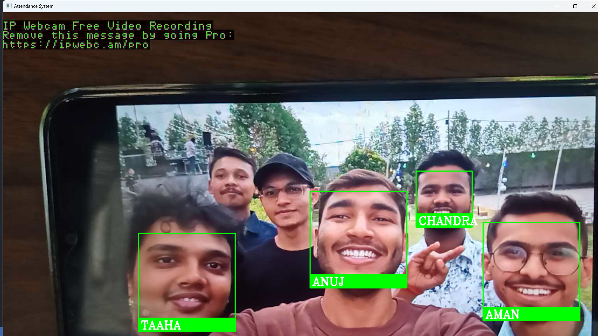

# Facial Recognition Based Attendance System
<hr>

## Description:
> This project is a facial recognition-based attendance system built using dlib’s state-of-the-art face recognition library with deep learning. The system is designed to streamline and automate the process of recording attendance by leveraging advanced facial recognition technology.

## Prerequisites:
1. `Python v3.9 >`
2. `Cmake` - install using official website
3. `Visual Studio`- community version
4. `dlib` - use Visual Studio to download C++ toolkits
5. `A phone camera` (OPTIONAL): installed with `IP webcam` 
6. Register the people by importing the clear image of their face in `Training_images` folder

## Installation:
#### Step:1: 
```
mkdir facial-recognition
cd facial-recognition
```
#### Step:2:
Clone:
```
git clone https://github.com/VishalJxA/Smart-Attendance-System.git
```
#### Step:3:
```
pip install -r requirements.txt
```

#### Step:4:
Running the program
```
python main.py
```


## Results:
> Snapshot

<hr>


